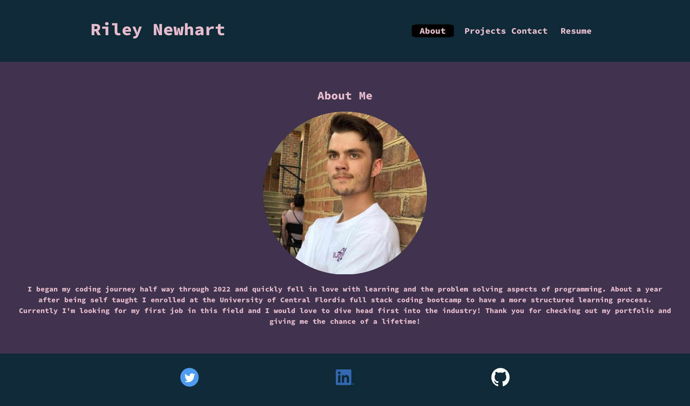

# Personal React Portfolio

## Table of Contents:

- [Description](#description)
- [Installation](#installation)
- [Usage](#usage)
- [License](#license)
- [Contributions](#contributions)
- [Tests](#tests)
- [Questions](#questions)

## Description:

- Personal portfolio built using React.js. Find information about me, 6 of my favorite projects, the best way to contect me, and my downloadable resume! Thanks for taking a look!

## Installation:

- Clone the github repo to your local machine. Open the application in vscode and run "npm i" in the root directory. Finally, you can run "npm start" to get the application running on local host 3000.

## Usage

- Link to deployed application https://rileynewhart.com/
- Screenshot of index page
- 

## License

- license : MIT 

- https://opensource.org/licenses/MIT

## Contributions

- N/A

## Tests

- N/A

## Questions

- Have any questions? You can contact me here.
- Github: https://github.com/Rilaey
- Email: rileynewhartx@gmail.com
